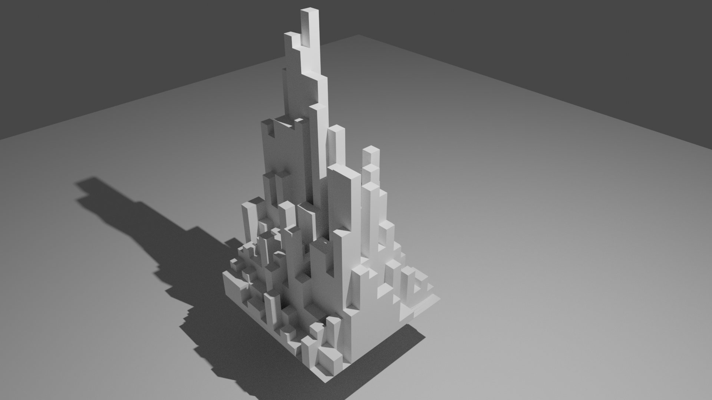

# Thanks, I hate it.
Render histograms in Blender.

  

Instructions
---

The script in `createMesh.py` creates an extruded grid mesh within Blender, based on a JSON file that contains a 2D array representing the histogram bin contents. You can run this from the Python console within Blender by first passing adding the JSON file path to the 'arguments' list with `impory sys; sys.argv.append('data.json')`, and the execute the script with `exec(open("createMesh.py").read())`.

It's pretty barebones at the moment, and doesn't support histograms with an aspect ratio different from one, nor non-uniform bins. It probably will also crash if you go above a binning of around `100x100`.

However, you can create some cool animations using the model.

 

  

Also included is a script (`prepareJSON.py`) to convert [ROOT](https://root.cern.ch/) TH2s to JSON using [uproot](https://github.com/scikit-hep/uproot) (because it wouldn't be truly hideous if they weren't ROOT histograms, right?). This can also generate some test data of two Normal distributions if you don't have any dodgy looking histograms of your own.

Wishlist
-----
* Coloured histogram blocks
* Support smoothing of the histogram mesh within Blender
* Good default settings for automatic rendering
* Finer binnings without killing Blender
