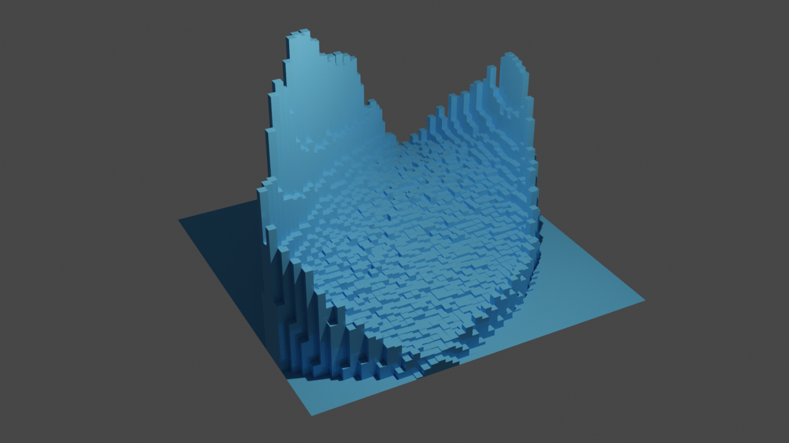

# Thanks, I hate it.
Render histograms in Blender.

 

  

To do
-----
* Coloured histogram blocks
* Support smoothing of the histogram mesh within Blender
* Good default settings for automatic rendering
* Finer binnings without killing Blender
